# PedalGo — Location de vélos entre particuliers

**Projet individuel final — INF4079 Programmation Mobile**

---

## 1. Présentation du projet

PedalGo est une application mobile permettant à des particuliers de louer leurs vélos à d'autres utilisateurs. Les propriétaires publient des annonces, définissent les prix et gèrent les disponibilités. Les locataires recherchent, filtrent et réservent des vélos selon leurs besoins.

L'application repose sur une architecture moderne utilisant **Expo** et **Firebase**. Elle met l'accent sur la gestion asynchrone, le fonctionnement hors ligne et la résolution de conflits de données.

---

## 2. Stack technique

| Technologie | Rôle |
|---| ---|
| React Native | Framework mobile cross-platform |
| Expo | Tooling, build, dev server |
| TypeScript | Typage statique |
| Firebase Auth | Authentification email/mot de passe |
| Firebase Firestore | Base de données temps réel |
| Expo Router | Navigation file-based (Stack + Tabs) |
| Context API | Gestion d'état globale |
| AsyncStorage | Stockage local (favoris, cache offline, session) |
| NetInfo | Détection état réseau |

---

## 3. Fonctionnalités principales

### 3.1 Authentification
- Inscription et connexion par **email + mot de passe** (Firebase Auth)
- **Session persistante** grâce à AsyncStorage (getReactNativePersistence)
- Navigation conditionnelle : routes publiques (explorer, détail vélo) et protégées (mes vélos, réservations, profil)
- Déconnexion sécurisée

### 3.2 Gestion des vélos (CRUD complet)
- **Création** d'annonces avec titre, description, type, prix/jour, localisation
- **Consultation** de tous les vélos disponibles
- **Modification** des annonces et de la disponibilité (en ligne et hors ligne)
- **Suppression** d'annonces
- **6 types de vélo** : Ville, VTT, Electrique, Route, Pliant, Cargo

### 3.3 Recherche et filtres
- **Recherche textuelle** (titre, description, localisation)
- **Filtre par type** de vélo
- **Filtre par fourchette de prix** (min/max EUR/jour)
- **Tri** par nom, prix, ville, type
- Seuls les vélos disponibles sont affichés

### 3.4 Réservation
- **Création** de demandes de réservation (durée, infos complémentaires, téléphone obligatoire)
- **Annulation** de demandes par le locataire (statut pending uniquement)
- **Acceptation / Refus** des demandes par le propriétaire
- **Historique** des réservations envoyées et reçues
- **Statuts** : En attente, Acceptée, Refusée, Annulée
- Impossible de réserver son propre vélo

### 3.5 Profil utilisateur
- Statistiques (vélos, réservations, demandes reçues, favoris)
- Gestion du numéro de téléphone avec toggle de visibilité
- Liste des favoris avec persistance locale

### 3.6 Favoris
- Ajout/suppression de vélos en favoris
- Persistance via AsyncStorage
- Compteur visible dans le profil

---

## 4. Fonctionnement hors ligne et gestion des conflits

### 4.1 Architecture offline

L'application utilise un système de **file d'attente hors ligne** (offline queue) via AsyncStorage :

1. Quand l'utilisateur modifie la disponibilité d'un vélo **sans connexion**, le changement est enregistré localement dans `@PedalGo:offlineQueue`
2. Le hook `useNetwork` (NetInfo) surveille l'état de la connexion en temps réel
3. À la **reconnexion automatique**, la fonction `syncOfflineChanges()` est déclenchée
4. Les changements sont appliqués séquentiellement sur Firestore
5. Une bannière orange "Mode hors ligne" informe l'utilisateur de l'état de la connexion

### 4.2 Résolution des conflits

**Règle imposée : La priorité est donnée au propriétaire du vélo.**

**Scénario type :**
- Le propriétaire rend son vélo indisponible hors ligne
- Pendant ce temps, des locataires créent des réservations en ligne (statut "pending")
- À la reconnexion, le service de synchronisation détecte le conflit

**Comportement :**
1. Le changement de disponibilité du propriétaire est appliqué en priorité
2. Toutes les réservations "pending" créées entre-temps pour ce vélo sont **automatiquement refusées**
3. Un **message UI** (bannière jaune) informe le propriétaire du nombre de demandes annulées
4. Les messages sont persistés localement et affichés jusqu'à ce que l'utilisateur les ferme

**Fichiers concernés :**
- `src/services/offlineService.ts` — File d'attente, synchronisation, résolution de conflits
- `src/hooks/useNetwork.ts` — Détection réseau et callbacks de reconnexion
- `src/screens/MyBikesScreen.tsx` — UI offline banner + messages de conflits

---

## 5. Choix d'architecture

### Structure du projet

Le projet suit une architecture en couches séparées, inspirée de bonnes pratiques React Native :

```
src/
  services/       Couche d'accès aux données (Firebase, AsyncStorage, offline)
  hooks/          Hooks personnalisés (logique métier)
  context/        Providers de contexte global (Auth, App)
  screens/        Composants écran (UI + présentation)
  components/     Composants réutilisables (BikeCard)
  data/           Données de démonstration (seed)
  theme/          Palette de couleurs
app/              Routage Expo Router (file-based routing, Stack + Tabs)
```

### Principes appliqués
- **Séparation des responsabilités** : services <-> hooks <-> écrans
- **Typage strict** TypeScript sur tous les fichiers
- **Gestion d'erreurs** explicite dans chaque service et hook
- **Seed idempotent** avec IDs déterministes (pas de doublons au relancement)
- **Navigation conditionnelle** basée sur l'état d'authentification

---

## 6. Instructions d'installation

### Prérequis
- Node.js >= 18
- npm
- Expo CLI (`npx expo`)
- Un émulateur Android ou l'app Expo Go sur un appareil physique

### Installation

```bash
# Cloner ou extraire le projet
cd PedalGo

# Installer les dépendances
npm install

# Lancer le serveur de développement
npx expo start
```

### Configuration Firebase

Le fichier `.env` à la racine contient la configuration Firebase :

```
EXPO_PUBLIC_FIREBASE_API_KEY=...
EXPO_PUBLIC_FIREBASE_AUTH_DOMAIN=...
EXPO_PUBLIC_FIREBASE_PROJECT_ID=...
EXPO_PUBLIC_FIREBASE_STORAGE_BUCKET=...
EXPO_PUBLIC_FIREBASE_MESSAGING_SENDER_ID=...
EXPO_PUBLIC_FIREBASE_APP_ID=...
EXPO_PUBLIC_FIREBASE_MEASUREMENT_ID=...
```

### Données de démonstration

Au premier lancement, si la collection `bikes` est vide, 15 vélos de démo sont automatiquement injectés avec des IDs déterministes (`seed_1` à `seed_15`). Ce mécanisme est idempotent : il ne crée pas de doublons aux lancements suivants.

---

## 7. Captures d'écran

> Placez vos captures d'écran dans le dossier `screenshots/` à la racine du projet.

| Ecran | Fichier attendu |
|---|---|
| Liste des vélos (Explorer) | 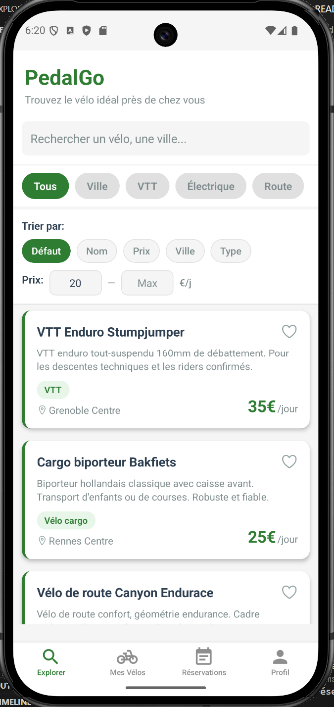 |
| Recherche et filtres | 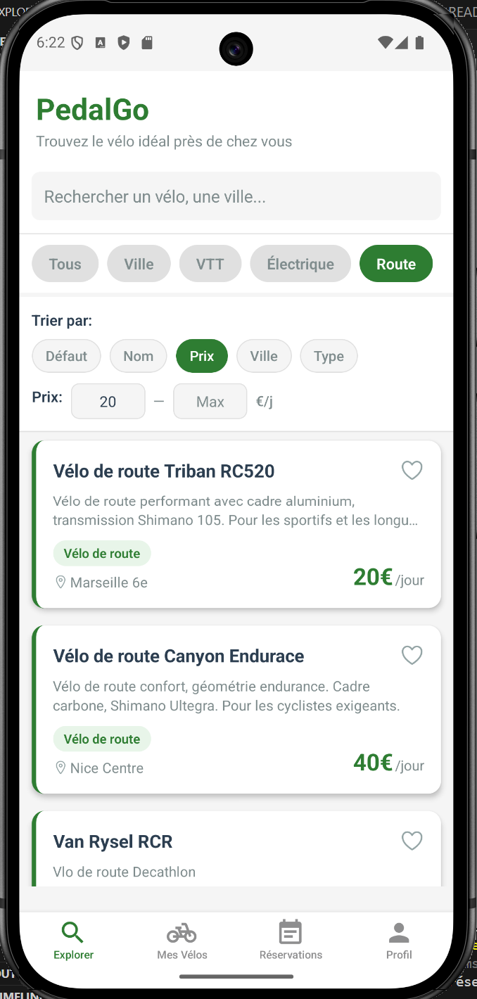 |
| Détail d'un vélo | 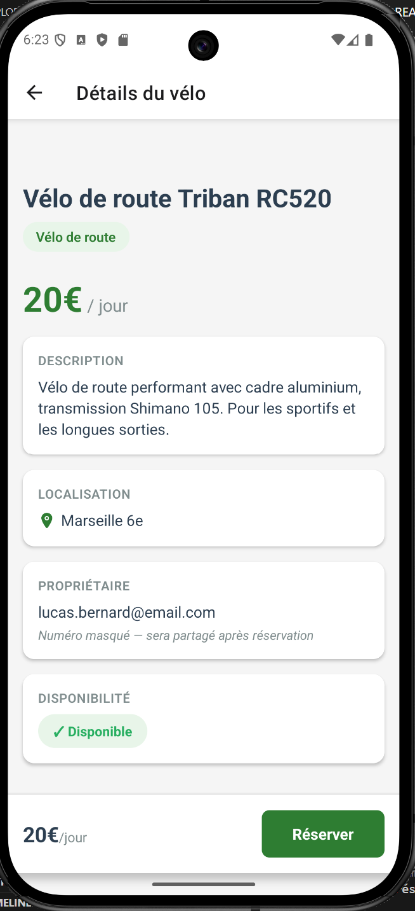 |
| Processus de réservation | 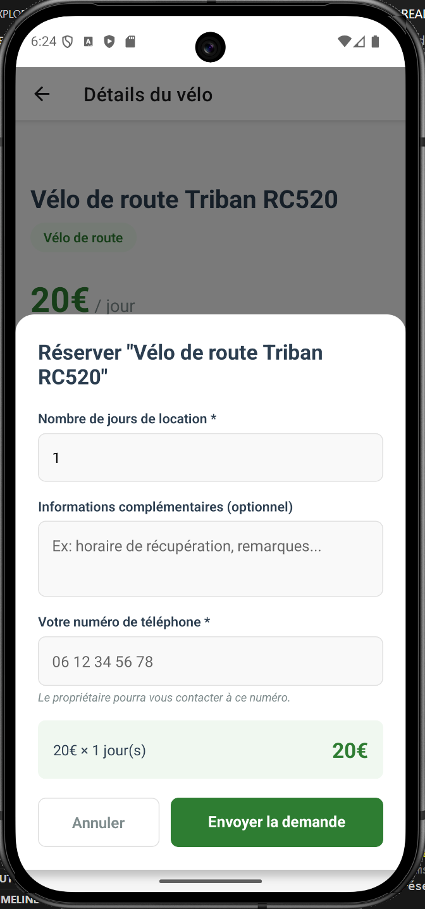 |
| Mes réservations (historique) | 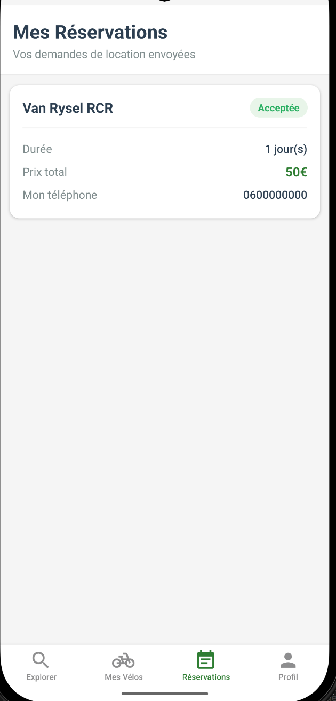 |
| Mes vélos (gestion) | 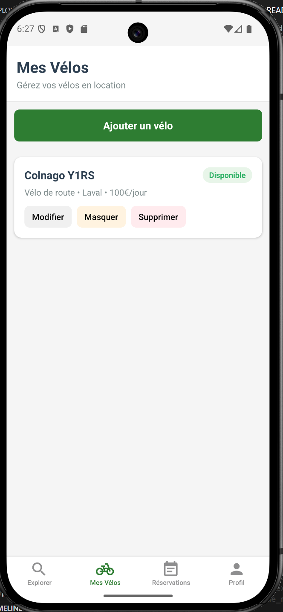 |
| Modification de disponibilité | 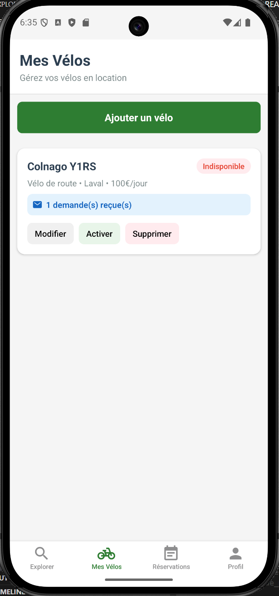 |
| Demandes reçues (accepter/refuser) | 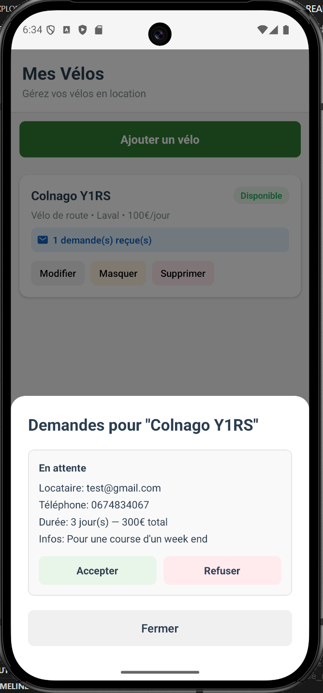 |
| Mode hors ligne (bannière) | 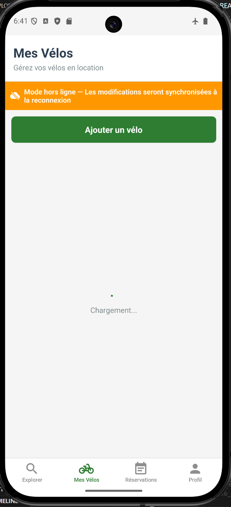 |
| Profil utilisateur | 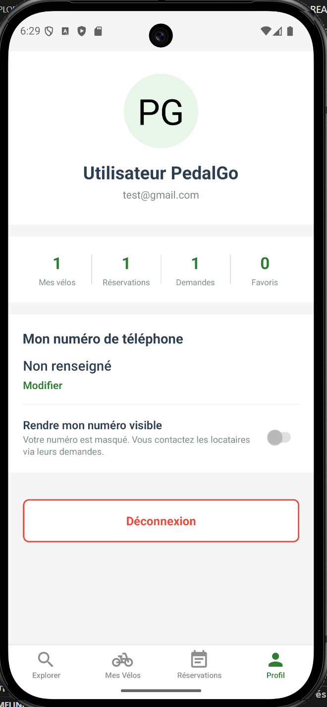 |
| Connexion | 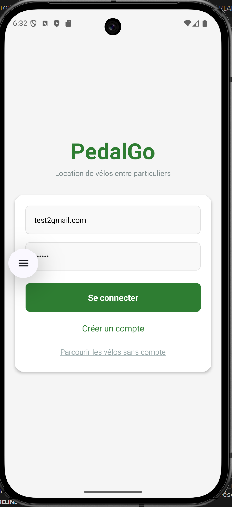 |
| Inscription | 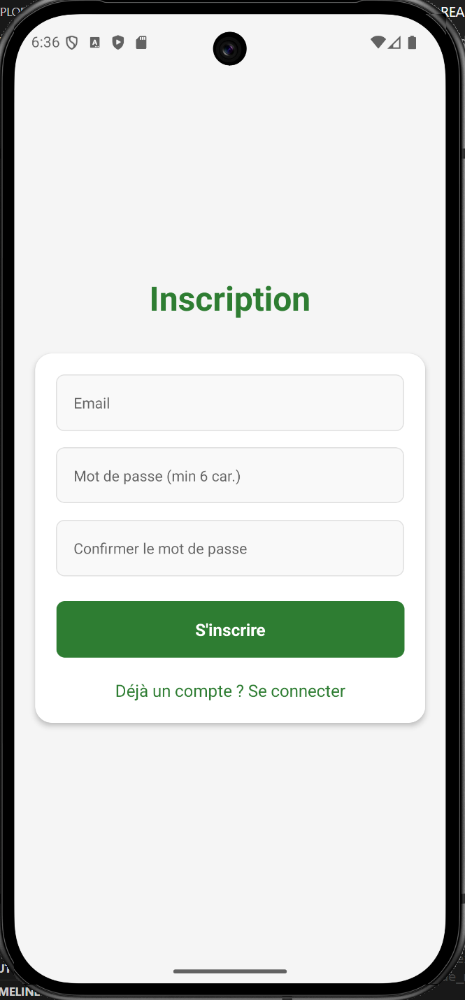 |

---

## 8. Génération de l'APK

*(Section à compléter)*

L'APK Android sera généré via EAS Build :

```bash
npx eas build --platform android --profile preview
```

---

## 9. Auteur

Projet réalisé dans le cadre du cours **INF4079 — Programmation Mobile** (ESIEA).